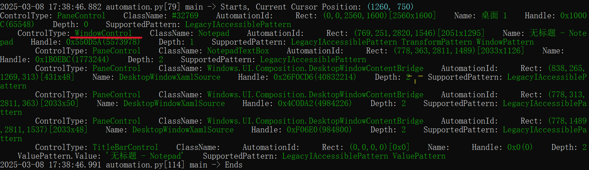

<font size=5>UIAutoMation指南</font>

<!--此处为文内使用的HTML, 请勿更改(以免造成内容错乱)-->

<style>
    .hid {
        color: black;
        background-color: black;
    }

    .hid:hover {
        color: white; /* 悬停时变为白色显示 */
    }
</style>

> `uiautomation`模块能直接兼容`pyautogui`支持这些操作, 还能通过控件定位方式直接定位到目标控件的位置, 而不需要自己去获取对应坐标位置. `uiautomation`模块不仅支持任意坐标位置截图, 还支持目标控件的截图, 缺点在于截取产生的图片对象难以直接与PIL库配合, 只能导出文件后让PIL图像处理库重新读取. 对于能够获取到其`ScrollItemPattern`对象的控件还可以通过`ScrollIntoView`方法进行视图定位, 与游览器的元素定位效果几乎一致.常规的热键功能一般使用pynput实现, 但`uiautomation模块`热键注册会比`pynput`更简单功能更强. `uiautomation`模块所支持的剪切板操作的功能也远远超过常规的专门用于剪切板复制粘贴的库. `uiautomation`模块能直接支持让python程序实现管理员提权

>uiautomation封装了微软UIAutomation API, 支持自动化Win32, MFC, WPF, Modern UI(Metro UI), Qt, IE, Firefox( version<=56 or >=60), Chrome谷歌游览器和基于Electron开发的应用程序(加启动参数–force-renderer-accessibility也能支持UIAutomation被自动化).  
uiautomation只支持Python 3版本, 依赖comtypes和typing这两个包, 但Python不要使用3.7.6和3.8.1这两个版本, comtypes在这两个版本中不能正常工作

项目网址: https://github.com/yinkaisheng/Python-UIAutomation-for-Windows

<font size=5>目录</font>

- [1. 基本原理及安装](#1-基本原理及安装)
- [2. 控制控件入门](#2-控制控件入门)
  - [1. 控件分析与可用参数](#1-控件分析与可用参数)


# 1. 基本原理及安装

**UIAutomation的工作原理: **

UIAutomation操作程序时会给程序发送WM_GETOBJECT消息, 如果程序处理WM_GETOBJECT消息, 实现UI Automation Provider,并调用函数
```
UiaReturnRawElementProvider(HWND hwnd,WPARAM wparam,LPARAM lparam,IRawElementProviderSimple *el)
```
此程序就支持UIAutomation.

`IRawElementProviderSimple` 就是 `UI Automation Provider`, 包含了控件的各种信息, 如`Name` `ClassName` `ContorlType`坐标等. 

UIAutomation 根据程序返回的 `IRawElementProviderSimple`, 就能遍历程序的控件, 得到控件各种属性, 进行自动化操作. 若程序没有处理`WM_GETOBJECT`或没有实现`UIAutomation Provider`, `UIAutomation`则无法识别这些程序内的控件, 不支持自动化. 

<span class=hid>很多DirectUI程序没有实现UIAutomation Provider, 所以不支持自动化</span>

使用如下指令安装`uiautomation`
```
python -m pip install uiautomation
```

安装后会在python安装目录下的`Scripts`目录下得到一个`automation.py`脚本, 可以使用它来准确获取目标窗口的控件结构信息  
当然也使用Windows自带的`inspect.exe`图形化工具来观察控件的树形结构<span class=hid>inspect.exe包含在WindowsSDK包里, 在Microsoft官网下载SDK后即可使用</span>
> ❗`inspect.exe`工具获取到的控件类型可能与`automation.py`脚本打印的结果不太一样, 如果发现控件实际不存在, 要以`automation.py`脚本打印的结果为准. 

# 2. 控制控件入门

## 1. 控件分析与可用参数

***示例: 使用uiautomation控制记事本***

以下程序可以打开记事本并使使其窗口前置

````py
import subprocess
import uiautomation as auto
 
subprocess.Popen('notepad.exe')# 从桌面的第一层子控件中找到记事本程序的窗口WindowControl
notepadWindow = auto.WindowControl(searchDepth=1, ClassName='Notepad')
print(notepadWindow.Name)# 设置窗口前置
notepadWindow.SetTopmost(True)
````

**可用参数说明:**

- searchFromControl = None: 从哪个控件开始查找, 如果为None, 从根控件Desktop开始查找
- searchDepth = 0xFFFFFFFF:  搜索深度
- searchInterval = SEARCH_INTERVAL: 搜索间隔
- foundIndex = 1 : 搜索到的满足搜索条件的控件索引, 索引从1开始
- Name: 控件名字
- SubName : 控件部分名字
- RegexName: 使用re.match匹配符合正则表达式的名字, Name,SubName,RegexName只能使用一个, 不能同时使用
- ClassName : 类名字
- AutomationId:  控件AutomationId
- ControlType : 控件类型
- Depth: 控件相对于searchFromControl的精确深度
- Compare: 自定义比较函数function(control: Control, depth: int)->bool
  
***searchDepth和Depth的区别:***
searchDepth在指定的深度范围内(包括1~searchDepth层中的所有子孙控件)搜索第一个满足搜索条件的控件
Depth只在Depth所在的深度(如果Depth>1，排除1~searchDepth-1层中的所有子孙控件)搜索第一个满足搜索条件的控件

为了进一步操作该程序，我们可以使用inspect.exe工具或automation.py脚本分析控件结构。

通过`inspect.exe`工具分析控件时可以看到记事本的编辑区类型为DocumentControl：

(点击窗口可以让inspect跳转到对应的栏目)

  

但`uiautomation`实际使用该类型查找控件时却会找不到控件报错。

下面使用automation.py脚本来分析目标窗口

在cmd执行`automation.py`后在1秒内将鼠标激活记事本窗口，可以看到控制台打印

  

关于控件类型参考[Windows 窗体控件](https://learn.microsoft.com/zh-cn/dotnet/desktop/winforms/controls/?view=netframeworkdesktop-4.8)

使用uiautomation向记事本输入文本

